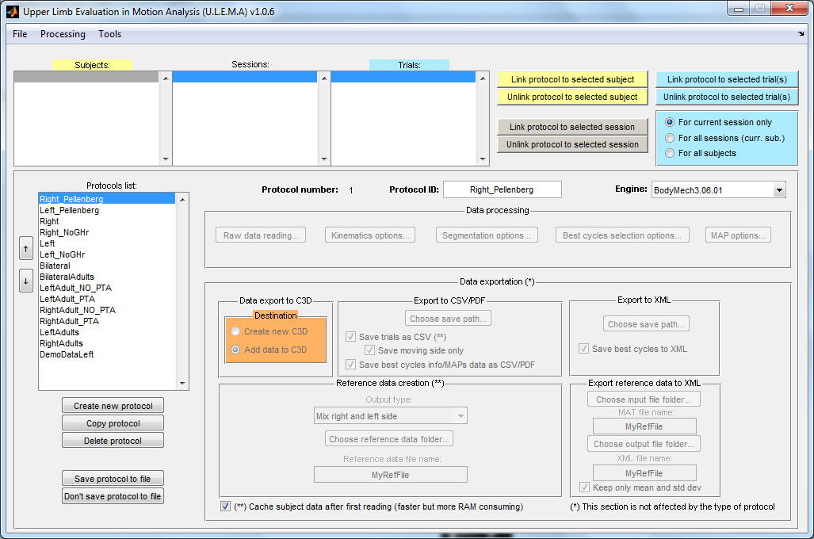

# U.L.E.M.A. Upper Limb Evaluation in Motion Analysis

U.L.E.M.A. is a MATLAB-based GUI tool for quickly processing three-dimensional upper limb movements that have been recorded using Motion Capture devices (C3D files).

With U.L.E.M.A. you can:
- Perform anatomical landmarks reconstruction and process joint kinematics by using the embedded engine [BodyMech](http://www.bodymech.nl/);
- Segment the motion file data into *motion cycles* by a certain custom-made schema;
- Calculate spatio-temporal parameters for cycles;
- Rank each cycles by using the RMSE technique (see articles below);
- Calculate clinically-relevant parameters such as Arm Value Score (AVS) and Arm Profile Score (APS);
- Add calibrated anatomical landmarks, kinematics and spatio-temporal parameters data back to the original C3D for [Polygon](http://www.vicon.com/Software/Polygon) reports;
- Export data in different formats (MAT, CSV, PDF, XML);
- Create reference data MAT files from processed data; 
- Save processed data MAT files for further late (re)processing;

It is bundled with the "Report Generator", a stand-alone Python-based and plugin-enabled GUI application for transforming custom-made templates into (editable) reports.

The software was developed by the Catholic University of Leuven (Belgium) through a collaboration between the following groups:
- [CMAL-P](http://www.uzleuven.be/en/laboratory-for-clinical-movementanalysis/research) (Clinical Movement Analysis Laboratory, UZ Pellenberg) 
- [PMA](http://www.mech.kuleuven.be/en/pma/) (Division of Production engineering, Machine design and Automation)
- [FaBeR](http://www.kuleuven.be/english) (Faculty of Kinesiology and Rehabilitation Sciences)

The most recent version of U.L.E.M.A. is **1.0.6**.

The most recent version of Report Generator is **1.1**.

---

**Requirements** for U.L.E.M.A.:
+ Windows XP / 7 (Linux / MacOSX are not yet supported)
+ [MATLAB](http://www.mathworks.nl/products/matlab/) (with [Signal Processing Toolbox](http://www.mathworks.nl/products/signal/) included)

**Requirements** for Report Generator:
+ Windows XP / Vista / 7

---
**Documentation:**

Both U.L.E.M.A and Report Generator are documented with manuals and additional useful information. These documents can be found inside the folder *Doc* of each application. 

---

Please **cite** the following articles when using the software; these articles provide a further description of the processing protocol:

1. **Jaspers, E.**, Feys, H., Bruyninckx, H., Cutti, A.G., Harlaar, J., Molenaers, G., Desloovere, K. **The reliability of upper limb kinematics in children with hemiplegic cerebral palsy.** Gait Posture 2011; 33(4): 568-575 (citations : 6) (IF most recent : 1.969).

2. **Jaspers, E.**, Feys, H., Bruyninckx, H., Klingels, K., Molenaers, G., Desloovere, K. **The Arm Profile Score: A new summary index to assess upper limb movement pathology.** Gait Posture 2011; 34(2): 227-233 (citations : 3) (IF most recent : 1.969).

Other relevant articles:

1. **Jaspers, E.**, Feys, H., Bruyninckx, H., Harlaar, J., Molenaers, G., Desloovere, K. **Upper limb kinematics: Development and reliability of a clinical protocol for children.** Gait Posture 2011; 33(2): 279-285 (citations : 8) (IF most recent : 1.969).

2. **Jaspers, E.**, Desloovere, K., Bruyninckx, H., Klingels, K., Molenaers, G., Aertbeliën, E., Van Gestel, L., Feys, H. **Three-dimensional upper limb movement characteristics in children with hemiplegic cerebral palsy and typically developing children**. Res Dev Disabil 2011; 32(6): 2283-2294 (citations : 3) (IF most recent : 2.483). 

3. **Jaspers, E.**, Feys, H., Bruyninckx, H., Molenaers, G., Klingels, K., Desloovere, K. **Review of quantitative measurements of upper limb movements in hemiplegic cerebral palsy**. Gait Posture 2009; 30(4): 395-404 (citations : 17) (IF most recent : 1.969).

---

This application builds upon following tools (already embedded in the application):

1. [BodyMech](http://www.bodymech.nl/)
2. [bt-k](http://code.google.com/p/b-tk/)
3. [XML Toolbox for MATLAB](http://www.mathworks.com/matlabcentral/fileexchange/4278-xml-toolbox)

We would like acknowledge the authors of these tools here! 

---

**What's new**

U.L.E.M.A.:

1.0.6 (14/06/2013):
- Raw data reading, previously part of the kinematics process, is now provided in a separate section. 
- Documentation updated  

1.0.5 (03/05/2013):
- When exporting to C3D, the region of non-forced-to-0 angles is expanded with 1 frame, to avoid
  bad visualization in Polygon
- MAPs bar graphs have colors for a better indentifaction of overlapping IQR
- MAPs title is split in 2 rows, to avoid clipping when too long

1.0.4 (22/05/2013):
- For the angle curves, data is forced to 0 before the first event and after the last event,
  for every file, before exporting to C3D. This way, the angle data between the first and last event
  is of good quality, since we agreed to have good marker data in that interval (check in Nexus). Without bad marker data,
  Polygon will never parse for bad data into the C3Ds and will always plot curves data.

1.0.3 (30/04/2013):
- Added automatic gimbal-lock correction for joint angles
- timeVmax is in % of the phase duration and not in seconds anymore
- protocols Left, Right, Right_Pellenberg, Left_Pellenberg, Right_NoGH_Pellenberg, Left_NoGH_Pellenberg
  edited to follow planned protocol at UZ Pellenberg 

1.0.2 (04/03/2013):
- Corrected measurement unit for trajectory index when exporting to C3D
- Technical marker data is not written back anymore to C3D (for safety reasons)
- "Proc. data saving" is added under Options -> Processing
- Documentation updated with section 6.6
- In ProtDB.mat 2 new protocols added that are used in CMAL-P (Leuven, Belgium)

1.0.1 (11/10/2012):
- First draft of documentation created
- Minor user-interface labels changed
- For a selected segmentation method, a small description is shown

1.0 (05/10/2012):
- Official name for the software is decided:
  U.L.E.M.A.: Upper Limb Evaluation in Motion Analysis

1.0 (24/09/2012):
- First release

Report generator:

1.1 (05/10/2012): 
- Added "Descriptors Editor" tool under main window -> "Tools" -> "Descriptors Editor..."
- The software is now plugin based (where UL is the only puglin available now); this makes the
  software ideally customizable for every other purpose

1.0 (24/09/2012):
- First release

